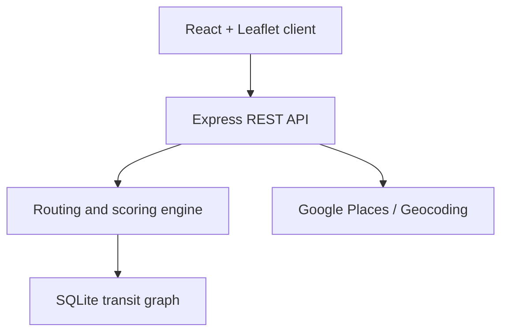

<div align="center">


<br>


### One journey. Multiple modes. Better decisions.

A full-stack route planner that compares multimodal journeys across India by
**travel time, fare, transfers, and carbon emissions**.

[Features](#features) · [Architecture](#architecture) · [Quick Start](#quick-start) ·
[API](#api-reference) · [Roadmap](#mission-critical-roadmap)

</div>

---

## Overview

**India Transit Planner** combines flights, trains, metro services, buses, and
first/last-mile road travel into complete door-to-door itineraries. Instead of
returning a single route, the engine generates distinct alternatives so users
can choose the journey that best matches their priorities.

The current repository is a working research prototype with a React map
interface, an Express routing API, a seeded SQLite transit graph, and a
time-dependent Dijkstra-based pathfinder.

## Features

- **Multimodal routing:** flight, train, metro, bus, road, and walking transfers
- **Multiple alternatives:** fastest, cheapest, eco-friendly, and rail/transit
  options when distinct routes are available
- **Time-dependent search:** accounts for departure times, schedules, waiting,
  and day rollover
- **Journey comparison:** duration, estimated fare, CO₂ emissions, transfers,
  transport mix, and route-specific pros/cons
- **Interactive map:** Leaflet route lines, start/end markers, intermediate
  stops, segment colors, and popups
- **Location search:** Google Places and Geocoding through a backend proxy, with
  a local SQLite fallback
- **Step-by-step itinerary:** segment times, operators, stops, modes, and costs
- **English and Hindi UI:** built-in language switching
- **Popular journeys:** presets for Delhi, Mumbai, Bengaluru, Chennai, Vellore,
  Agra, Jaipur, and Noida
- **Responsive dark interface:** map-first layout with route cards and
  glassmorphism styling

> [!NOTE]
> Booking confirmation and live disruption alerts are currently simulated for
> demonstration. The repository does not perform real ticket purchases or
> consume production transit-delay feeds.

## Route strategies

| Strategy | Optimization focus | Typical mode mix |
|---|---|---|
| **Fastest** | Minimum end-to-end travel time | Flights and rapid local access |
| **Budget** | Lower total estimated fare | Trains, buses, metro, and walking |
| **Eco** | Lower estimated CO₂ emissions | Rail and public transit |
| **Rail & Transit** | Flight-free public transport | Trains, metro, buses, and road links |

Every option can include first-mile access, scheduled long-distance segments,
intermodal walking transfers, and last-mile travel.

## Architecture



### Routing flow

1. The user enters an origin, destination, and departure time.
2. The backend resolves both locations using the local stop database or Google
   Maps APIs.
3. The engine loads stops, schedules, routes, and intermodal transfers as a
   weighted graph.
4. Time-dependent Dijkstra searches the graph under different scoring rules.
5. The API enriches each distinct result with fare, emissions, transport mix,
   pros/cons, and sequence metadata.
6. The frontend compares the alternatives and draws the selected path on the
   map.

## Technology stack

| Layer | Technology |
|---|---|
| **Frontend** | React 19, Vite 8, Leaflet, Lucide React, CSS |
| **Backend** | Node.js, Express, CORS, dotenv |
| **Database** | Node's built-in SQLite `DatabaseSync` API |
| **Routing** | Time-dependent Dijkstra, Haversine distance, preference scoring |
| **Maps** | CARTO dark tiles, OpenStreetMap attribution, Google Places/Geocoding |

## Repository structure

```text
indiaTravelApp/
├── backend/
│   ├── database.js          # Schema and seeded Indian transit data
│   ├── routing.js           # Graph construction and routing strategies
│   ├── server.js            # Express API and location-resolution proxy
│   ├── test-routing.js      # Routing smoke test
│   ├── test-delhi-ix.js     # Additional route test
│   └── transit.db           # Local SQLite database
├── frontend/
│   ├── public/              # Icons and favicon
│   ├── src/
│   │   ├── components/
│   │   │   └── MapContainer.jsx
│   │   ├── App.jsx
│   │   ├── App.css
│   │   ├── index.css
│   │   └── main.jsx
│   └── package.json
├── assets/
│   └── readme-banner.svg
├── MULTIMODAL_ROUTES_README.md
├── package.json
└── README.md
```

## Quick start

### Prerequisites

- **Node.js 22 or newer** — required for the built-in `node:sqlite` module
- npm
- A modern browser
- Optional: a Google Maps API key with Places and Geocoding enabled

### 1. Clone the repository

```bash
git clone https://github.com/suhaniibalchandanii/indiaTravelApp.git
cd indiaTravelApp
```

### 2. Install dependencies

The repository is configured as an npm workspace:

```bash
npm install
```

### 3. Configure the backend

```bash
cp backend/.env.example backend/.env
```

Edit `backend/.env`:

```env
GOOGLE_MAPS_API_KEY=your_google_maps_api_key
PORT=5001
```

The Google key is optional. Without it, autocomplete and geocoding fall back to
locations seeded in the local database.

### 4. Start the backend

```bash
npm run dev:backend
```

The API runs at `http://localhost:5001`.

### 5. Start the frontend

In a second terminal:

```bash
npm run dev:frontend
```

Open the Vite URL printed in the terminal, normally `http://localhost:5173`.

## Available scripts

| Command | Purpose |
|---|---|
| `npm run dev:backend` | Start the Express server in watch mode |
| `npm run dev:frontend` | Start the Vite development server |
| `npm run build --workspace=frontend` | Create a production frontend build |
| `npm run lint --workspace=frontend` | Run ESLint on the frontend |
| `node backend/test-routing.js` | Exercise fastest and cheapest routing |
| `node backend/test-delhi-ix.js` | Run the Delhi-focused route test |

## API reference

| Method | Endpoint | Purpose |
|---|---|---|
| `GET` | `/api/health` | API status and Maps configuration check |
| `GET` | `/api/stops` | Return locally available transit stops |
| `GET` | `/api/places?input=...` | Autocomplete through Google or local fallback |
| `GET` | `/api/geocode?address=...` | Resolve an address or place ID |
| `POST` | `/api/route` | Generate multiple route alternatives |
| `GET` | `/api/route?from=...&to=...` | Query routes using text locations |
| `GET` | `/api/fare?from=...&to=...` | Estimate fare and segment breakdown |
| `GET` | `/api/realtime?from=...&to=...` | Generate demonstration status updates |

### Route request

```bash
curl -X POST http://localhost:5001/api/route \
  -H "Content-Type: application/json" \
  -d '{
    "origin": {
      "name": "Vellore Fort & City Centre",
      "lat": 12.9358,
      "lon": 79.1316
    },
    "destination": {
      "name": "Connaught Place Landmark",
      "lat": 28.6304,
      "lon": 77.2177
    },
    "startTime": "07:00",
    "preference": "fastest"
  }'
```

The response contains an array of route alternatives with full segment paths,
duration, fare, CO₂, transfers, badges, transport mix, and explanatory metadata.

## Data model

The local SQLite database contains four core tables:

| Table | Purpose |
|---|---|
| `stops` | Airports, railway stations, metro stops, bus stops, and landmarks |
| `routes` | Named transport services and their modes/colors |
| `schedules` | Origin–destination timings, duration, cost, and CO₂ estimates |
| `inter_modal_transfers` | Walkable links between nearby transport hubs |

The database is re-seeded from `backend/database.js` when the backend starts,
making the demo deterministic and easy to reset.

## Tested example

The included backend smoke test successfully generates different alternatives
from Dwarka, Delhi to the Gateway of India, Mumbai. In the current seeded data,
the fastest example combines road access, a flight, and last-mile road travel;
the cheaper example uses metro, walking transfer, rail, and last-mile travel.

Route values are estimates from the prototype dataset and should not be treated
as live schedules, official fares, or booking availability.

## Mission-critical roadmap

The broader proposal behind this prototype explores secure, synchronized
mobility for time-critical government and field deployments. Planned research
directions include:

- Parallel, atomic booking across multiple transport sectors
- Dynamic rerouting from live delays, weather, and operational constraints
- Offline-first encrypted itinerary access and edge synchronization
- A centralized logistics command dashboard for group movement oversight
- Bulk deployment planning and capacity matching
- Zero-trust access, pseudonymized traveler data, and auditable transactions
- Resilient microservices and secure integrations with authorized transit APIs

These capabilities are **future scope** and are not implemented by the current
prototype.

## Security and data notes

> [!WARNING]
> Never commit real API keys or operational data. Keep `.env` files out of Git,
> commit only `.env.example`, and rotate any credential that has previously been
> exposed. Restrict Google API keys by API, referrer/IP, and environment.

For any future government or defence use, the system would require formal
security architecture, authorization, threat modelling, privacy controls,
independent assessment, and approval from the relevant agencies. Marketing
phrases such as “military-grade” are not substitutes for verified controls.

## Current limitations

- Transit schedules, fares, emissions, and alerts are prototype data.
- Ticket booking is simulated; there is no payment or reservation integration.
- The frontend API base URL is currently fixed to `http://localhost:5001`.
- The SQLite API used by the backend remains experimental in Node.js.
- Real deployment requires authentication, rate limiting, validation, secure
  secrets management, monitoring, and production transit integrations.

## Author

Developed by **Suhani Balchandani**.

[](https://github.com/suhaniibalchandanii)

---

<div align="center">

Built to make complex journeys easier to compare — one route graph at a time.

</div>
